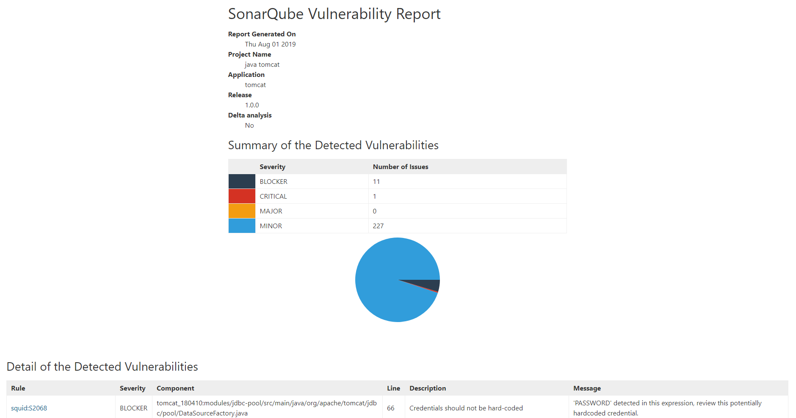
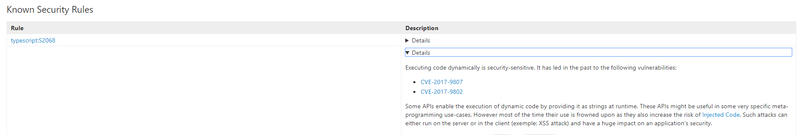

# sonar-report

[](https://sonarcloud.io/dashboard?id=soprasteria_sonar-report)
[](https://github.com/soprasteria/sonar-report)
[](https://david-dm.org/soprasteria/sonar-report?path=client&view=list)
[](https://david-dm.org/soprasteria/sonar-report?path=client&type=dev&view=list)





## Install

Compatible with node 10+ (tested with node 10 -> 14)

```bash
$ npm install -g sonar-report
```

## Use
- See all options with:
```
$ sonar-report --help
SYNOPSIS
    sonar-report [OPTION]...
```
- Environment: 
  - http_proxy : the proxy to use to reach the sonarqube instance (`http://<host>:<port>`)
  - NODE_EXTRA_CA_CERTS
    - the custom certificate authority to trust (troubleshoots `Unable to verify the first certificate`) 
    - the variable holds a file name that contains the certificate in pem format (root CA or full trust chain)

- Example:
```bash
# Generate report example
sonar-report \
  --sonarurl="https://sonarcloud.io" \
  --sonarcomponent="sopra-steria:soprasteria_sonar-report" \
  --project="Sonar Report" \
  --application="sonar-report" \
  --release="1.0.0" \
  --branch="feature/branch" \
  --sinceleakperiod="false" \
  --allbugs="false" > /tmp/sonar-report_sonar-report.html


# Open in browser
xdg-open /tmp/sonar-report_sonar-report.html
```

## Some parameters explained
### sinceleakperiod

The `sinceleakperiod` parameter activates delta analysis. If `true`, sonar-report will only get the vulnerabilities that were added since a fixed date/version or for a number of days. For this it will:

- get `sonar.leak.period` value using sonar settings API.
- filter accordingly when getting the issues using the issues API.

When sinceleakperiod is activated, the report will include an additional `Reference period` field that holds the leak period configured in SonarQube.

More info:

- [Sonar documentation](https://docs.sonarqube.org/latest/user-guide/fixing-the-water-leak/ "leak period")
- In sonarQube, /settings : see leak period

### allbugs
- "false": only vulnerabilities are exported
- "true": all bugs are exported

### fixMissingRule
On some versions of sonar (found on 6.5), the `type` of issue and the `type` of the rule don't match (for example `VULNERABILITY` vs `CODE_SMELL` ). 

In this case, when `allbugs=false`, it's possible that the issue is extracted but not it's rule. What will happen is that the issue has `/` in the description (because the description is the name of the rule).

To circumvent this issue, the fixMissingRule will extract all rules without any filter on the `type`. 

Beware that, with this parameter activated, all the issues linked to the rules displayed may not be displayed. 

### noSecurityHotspot
Sonar-report will try to find how your sonarqube instance is working with hotspots depending on the running version. However in last resort, you can use the `--noSecurityHotspot="true"` flag in order to deactivate the hotspots processing. 

**Note that you may miss out on some vulnerabilities when using this option if your sonarqube instance does support hotspots.**

General information about security hotspots: https://docs.sonarqube.org/latest/user-guide/security-hotspots/

Here's a brief history of sonarqube dealing with hotspots. 

- version < 7.3
  - hotspots don't exist
- 7.3 <= version < 7.8: 
  - hotspots are stored in the /issues endpoint
  - issue status doesn't include TO_REVIEW, IN_REVIEW yet
  - issues type includes SECURITY_HOTSPOT
  - rules type includes SECURITY_HOTSPOT for now on
- 7.8 <= version < 8.2
  - hotspots are stored in the /issues endpoint
  - issue status includes TO_REVIEW, IN_REVIEW
  - issues type includes SECURITY_HOTSPOT
- version >= 8.2 
  - hotspots are in a dedicated endpoint /hotspots
  - issues status don't include anymore TO_REVIEW, IN_REVIEW
  - issues type don't include anymore SECURITY_HOTSPOT


A few notes: 
- this behavior was verified using the embedded web_api documentation from dockerhub community distributions
- Versions 7.2 and 7.3 couldn't be verified as they are not present on dockerhub (and sonarqube doesn't seem to be publishing the API documentation per version)
- some implementations may not work as expected: for example sonarcloud v8.0 doesn't know about hotspots. When using sonarcloud v8.0 please use the `--noSecurityHotspot="true"` flag

To verify how your instance deals with hotspots, check: 
- ${sonarBaseURL}/api/system/status
- ${sonarBaseURL}/web_api/api/issues/search (check Possible values of parameters `statuses`, `types`)
- ${sonarBaseURL}/web_api/api/rules/search (check Possible values of parameter `types`)
- ${sonarBaseURL}/web_api/api/hotspots

## Develop

Get the dependencies:

```bash
npm install
```

Run with the same command as [Use](#use) but use `node index.js` instead of `sonar-report`

## Troubleshooting

- The description is "/"

Set `fixMissingRule` to true

- Error `Value of parameter 'types' (SECURITY_HOTSPOT) must be one of: [CODE_SMELL, BUG, VULNERABILITY]"}]}`
- or: `Error while getting issues :  - Response code 400 (Bad Request) - 400 - Bad Request - {"errors":[{"msg":"Value of parameter \u0027statuses\u0027 (TO_REVIEW) must be one of: [OPEN, CONFIRMED, REOPENED, RESOLVED, CLOSED]"}]}`

Your version of sonarQube doesn't support security hotspots. Set `noSecurityHotspot` to true. (more info check "noSecurityHotspot" description above)

- `{"errors":[{"msg":"Can return only the first 10000 results. 10500th result asked."}]}`

This is a limitation in sonarQube API. There is no way around it to date apart from adding limiting filters

Try removing `--allbugs=true` or tune the query in index.js (see /web_api/api/issues under your sonarQube instance)

See also this discussion https://community.sonarsource.com/t/cannot-get-more-than-10000-results-through-web-api/3662/4